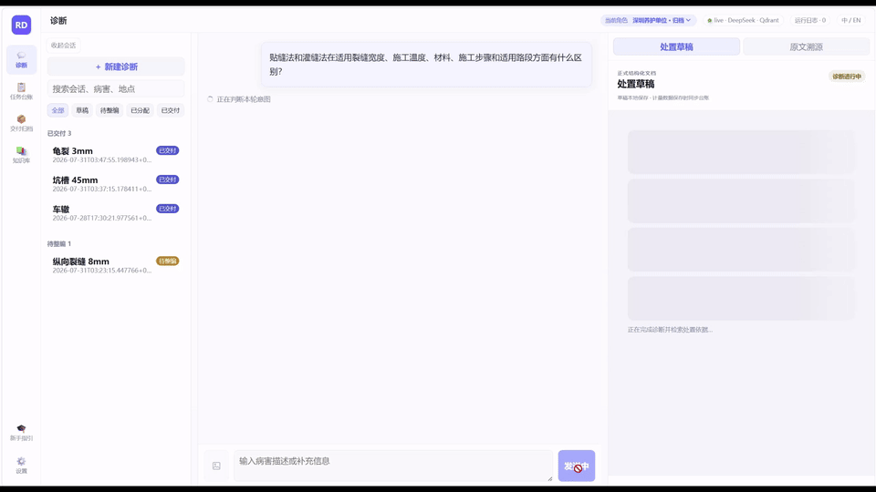
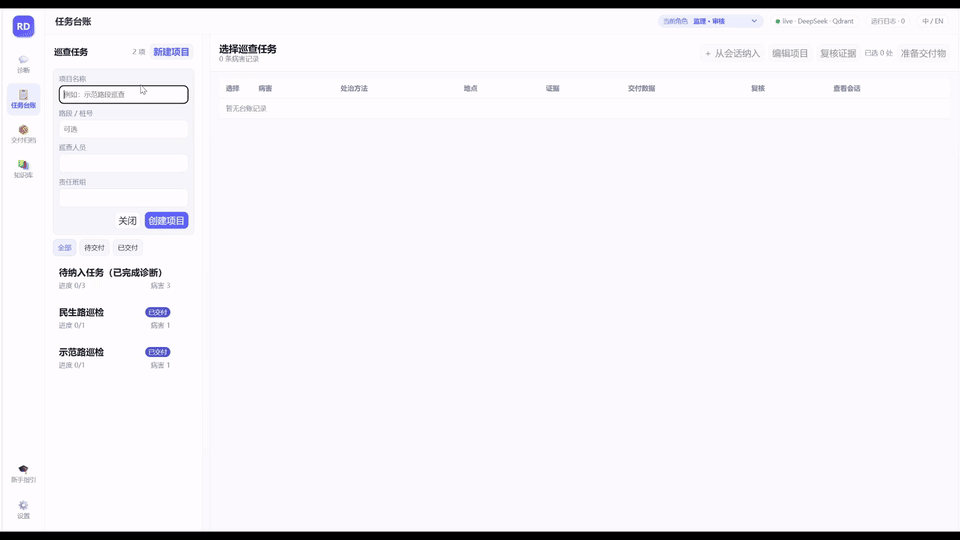
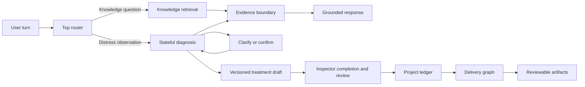
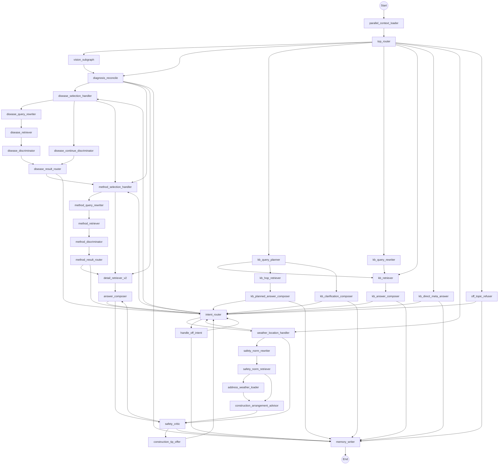

# Road Distress Agent

**For inspectors who bring a field observation, maintenance engineers who need evidence, and project leads who need a reviewable maintenance package—not another chat transcript.**


Start with a question from an imported guide or a road-distress observation. The workspace routes the task, carries diagnostic state through clarifications and corrections, and grounds the result in retrieved evidence. A diagnosis becomes a versioned treatment draft that inspectors complete, reviewers approve or return, and archivists package at project level.

[Explore the workflow](#how-it-works) · [Read the design notes](#design-notes) · [Run locally](#quick-start)

*Chinese-language walkthrough: begin a diagnosis, take a knowledge side path, correct the measured crack width, resume the pending stage, and review the grounded treatment draft.*

## Why this exists

An inspector may photograph a defect and record incomplete observations at the roadside. Back at the office, a maintenance engineer searches manuals, reconciles the observation, and decides what still needs to be measured. A project lead then combines several confirmed records into a report, maintenance plan, and cost worksheet.

Without a shared workflow, that handoff becomes photos, browser tabs, copied notes, and spreadsheets. A general chatbot can answer a sentence, but it does not know whether the sentence is a request for a clause, a correction to a field fact, or a candidate selection that should change the next stage.

One diagnosis thread is scoped to one distress case. An inspection project aggregates many promoted defect records, because that is how a road segment is inspected and handed off.

| A generic chat flow | This workspace |
| --- | --- |
| One prompt path for every request | Routes knowledge questions and distress cases into different workflows |
| Chat answer becomes the record | Agent output becomes a treatment draft; role capabilities govern completion, review, and archive |
| Retrieval is an implementation detail | Evidence, citations, and answerability are part of the result contract |
| Conversation state is incidental | Checkpoints, interrupts, corrections, and resumptions are first-class state |
## What it does

### Answer against an imported knowledge base

Ask: “What checks does my imported maintenance guide require before reopening a repaired lane?” The knowledge path plans retrieval when needed, selects supported evidence, and returns a cited answer or an evidence-boundary outcome.



*Two knowledge-only turns: a cited comparison of crack-sealing methods, followed by an evidence-composed workflow from severe alligator-cracking assessment to acceptance and source inspection.*

### Diagnose an observation as a staged conversation

Say: “There is a shallow elongated depression after repeated traffic.” The diagnosis path collects discriminating facts, retrieves disease and treatment evidence, and asks for clarification or candidate confirmation before producing a structured recommendation.
### Resume after an interruption or correction

Reply: “The measured crack width is eight millimetres, not six.” Checkpoints retain the thread, and reconciliation revisits the stage affected by that correction instead of treating the reply as a new case.
### Turn a diagnosis into reviewed project work

The graph supplies the disease, method, evidence-backed steps, and acceptance criteria; it does not pretend to know every auditable field fact. Inspectors complete measurements and location, reviewers can edit, return, or approve the versioned draft, and archivists aggregate approved records for delivery. Field provenance prevents a later AI refresh from silently replacing human edits.



*Project handoff walkthrough: create an inspection project, select confirmed findings, archive the delivery package, and open the generated document.*

## How it works



Knowledge Q&A and distress diagnosis are not two labels for the same prompt. A knowledge request is primarily a retrieval-and-composition problem. A diagnosis has staged state, fact corrections, candidate choices, and a different output contract. Both workflows share retrieval, citations, checkpointing, and runtime traces.

<details>
<summary>Full runtime graph from the public <code>graph.py</code></summary>


</details>
## Design notes

#### When a corrected fact invalidates a downstream conclusion

A user first says “the crack is about six millimetres,” then corrects it to “measured at eight.” Appending that sentence to chat history asks a model to notice that an earlier disease candidate, treatment choice, or answer is stale; that is a state-invalidation failure waiting to happen.

`diagnosis_reconcile` merges the new text, visual description, and known facts into structured fields. When a field changes, it finds the earliest affected stage and explicitly clears the derived state from that stage onward before routing again.

[diagnosis_reconcile.py](src/road_distress_agent/nodes/diagnosis_reconcile.py) · [diagnosis_dependencies.py](src/road_distress_agent/nodes/diagnosis_dependencies.py)
#### When a user asks a knowledge question in the middle of diagnosis

While the system is waiting for a crack measurement, a user may ask: “How should I measure that width?” Treating this as the missing value contaminates diagnosis state; answering it as a new conversation loses the pending interrupt.

The top router can take a knowledge side path and preserve the original interrupt for the next turn. Its invariants also repair impossible jumps, such as asking for procedure evidence before a treatment has been selected.

[top_router.py](src/road_distress_agent/nodes/top_router.py) · [top_router_invariants.py](src/road_distress_agent/nodes/top_router_invariants.py)
#### When retrieval returns text but cannot support an answer

A question can be in scope for road maintenance while the imported corpus lacks evidence for it. A fail-open RAG path treats nonempty retrieval as permission to generate, even when the retrieved text is merely similar.

The evidence gate is deterministic and returns `ANSWER`, `REFUSE`, or `ERROR`. Diagnosis requires procedure evidence; planned knowledge answers evaluate each evidence slot and expose only passing chunks. The gate contract also supports score and query-anchor checks, while the public runtime composer uses its R1 policy. A dependency failure represented in the assessment raises `ERROR`; retriever failures are deliberately not swallowed, so an infrastructure failure is not disguised as “the knowledge base has no material.”

[evidence_gate.py](src/road_distress_agent/evidence_gate.py) · [evidence_gate_runtime.py](src/road_distress_agent/nodes/evidence_gate_runtime.py) · [kb_evidence_boundary.py](src/road_distress_agent/nodes/kb_evidence_boundary.py) · [diagnosis_gate_boundary.py](src/road_distress_agent/nodes/diagnosis_gate_boundary.py)
#### When a decision is unambiguous enough for code

After a candidate list, “choose pothole” is a confirmation, not an open-ended reasoning task. Sending every such turn through an LLM router adds an avoidable model call and creates another opportunity to reinterpret a clear user instruction.

The deterministic confirmation route accepts only an exact, non-question, non-correction match in the active interrupt context. Ambiguous input falls back to the structured router. In this system’s evolution, removing an unnecessary LLM node is sometimes the right design change.

[deterministic_confirmation_route.py](src/road_distress_agent/nodes/deterministic_confirmation_route.py) · [top_router.py](src/road_distress_agent/nodes/top_router.py)
#### When a diagnosis becomes project work

A model can propose a disease name, treatment method, construction steps, and acceptance criteria; it cannot be the authoritative source for field measurements, location, task ownership, or review approval. Writing its answer directly into the ledger would erase that responsibility boundary, and a later agent refresh could overwrite a human correction.

The workspace therefore projects diagnosis into a versioned treatment draft with per-field provenance. Inspectors complete their own drafts, reviewers edit or return them before approval, and archivists move approved records into project delivery. The separate delivery subgraph then loads the ledger, confirms scope, runs its specialists and compliance review, and packages local artifacts.

[projects/models.py](src/road_distress_agent/projects/models.py) · [delivery/graph.py](src/road_distress_agent/delivery/graph.py) · [delivery/nodes/work_order.py](src/road_distress_agent/delivery/nodes/work_order.py)
## Execution traces

Nodes append structured audit events to the shared state. LLM and retrieval calls use dedicated trace helpers, and the API streams extracted trace events over SSE so a thread can be inspected by route, evidence, gate decision, and composition step.

The schema below is real; the values are synthetic.

```json
[
  {"sequence": 1, "schema_version": 1, "timestamp": "synthetic", "node": "top_router", "kind": "llm_call", "title": "Top-level route decision",
   "output": {"effective_route": {"action": "kb_aside", "rag_tier": "single_hop"}}},
  {"sequence": 2, "schema_version": 1, "timestamp": "synthetic", "node": "kb_retriever", "kind": "retrieval", "title": "KB evidence search",
   "retrieval": {"query": "synthetic query", "filters": {}, "chunk_count": 1, "chunks": [{"chunk_id": "synthetic-chunk"}]}},
  {"sequence": 3, "schema_version": 1, "timestamp": "synthetic", "node": "kb_answer_composer", "kind": "evidence_gate", "title": "Evidence gate decision",
   "output": {"decision": "ANSWER", "usable_chunk_ids": ["synthetic-chunk"], "passed_slots": [], "policy_tier": "R1"}},
  {"sequence": 4, "schema_version": 1, "timestamp": "synthetic", "node": "kb_answer_composer", "kind": "llm_call", "title": "KB answer composer LLM",
   "output": {"cited_chunk_ids": ["synthetic-chunk"]}}
]
```

[tracing.py](src/road_distress_agent/tracing.py) · [state.py](src/road_distress_agent/state.py) · [turn_stream.py](src/road_distress_agent/api/turn_stream.py)

## Quick start

Development mode starts the workspace without calling live models. You can inspect the UI, routing shell, and project surfaces, but a knowledge answer requires your own imported corpus and live model configuration. The commands below cover the public release's static and build checks; validation that requires private corpus data stays outside this repository.

```bash
git clone https://github.com/Iriss0904/road-distress-agent.git
cd road-distress-agent

python -m venv .venv
source .venv/bin/activate
python -m pip install --upgrade pip
python -m pip install -e ".[web,qdrant,dev]"
cp .env.example .env

docker compose up -d qdrant
cd frontend && npm ci && npm run build && cd ..
road-distress-web
```

Open `http://127.0.0.1:8010`. For frontend development, run `npm run dev` from `frontend/` in a separate terminal; set `VITE_API_TARGET` if the backend address changes.

```bash
curl --fail http://127.0.0.1:8010/api/profile
python -m pytest
ruff check .
cd frontend && npm run test && npm run build
```

## Bring your own knowledge base

Place authorized Markdown or text documents in `data/raw/`, then import and index them:

```bash
python scripts/import_documents.py data/raw --out data/processed
python scripts/build_qdrant_index.py data/processed/<document-id>
```

The importer writes `rag_chunks.jsonl` under `data/processed/`; local inputs and outputs are ignored by Git. The index builder creates or upserts the collection named by `QDRANT_COLLECTION`.

For PDF ingestion, install the optional dependencies and run:

```bash
python -m pip install -e ".[ingestion,pass1,qdrant]"
python scripts/ingest_pdf_full.py --pdf data/raw/<your-document>.pdf --out data/processed
```

Re-run import and indexing after changing documents. `--recreate` deletes the configured Qdrant collection before indexing, so confirm the target service and collection first.

```bash
python scripts/build_qdrant_index.py data/processed/<document-id> --recreate
```

[data/README.md](data/README.md) describes the local-data contract.

## Project structure

```text
frontend/                    Vue workbench for diagnosis, knowledge, tasks, and delivery
src/road_distress_agent/api/ FastAPI routes, SSE streaming, and persistence adapters
src/road_distress_agent/nodes/ Routing, diagnosis, evidence, safety, and HITL nodes
src/road_distress_agent/retrieval/ Retrieval channels, fusion, reranking, and evidence selection
src/road_distress_agent/ingestion/ Document parsing and chunk construction
src/road_distress_agent/delivery/ Delivery graph and artifact writers; projects/ owns the ledger
scripts/ and data/           Import/index entry points and the ignored local-data contract
```

## Scope and limitations

- Outputs are decision-support artifacts and require qualified engineering review.
- The repository contains no road standards, field records, vector indexes, or cost-norm data; import only material you are authorized to use.
- Live text and image paths require configured external model services. PDF ingestion also depends on its optional parser runtime.
- Delivery produces local artifacts; email and calendar outputs remain drafts until a deployment adds an authorized outbound integration.
- Role capabilities model workflow responsibility, not login security; network deployments still need authentication, server-side authorization, transport security, backup, and secrets management.

## Roadmap, license, and security

- Expand review surfaces for multimodal field evidence.
- Add corpus versioning and collection-management workflows.
- Add delivery integrations without bypassing project-level review.

The project has no confirmed open-source license yet; see [the license notice](docs/release/LICENSE_PENDING.md). Read [SECURITY.md](SECURITY.md) for deployment and reporting guidance, and [the public-release audit](docs/release/PUBLIC_RELEASE_AUDIT.md) before publishing a derivative deployment.
